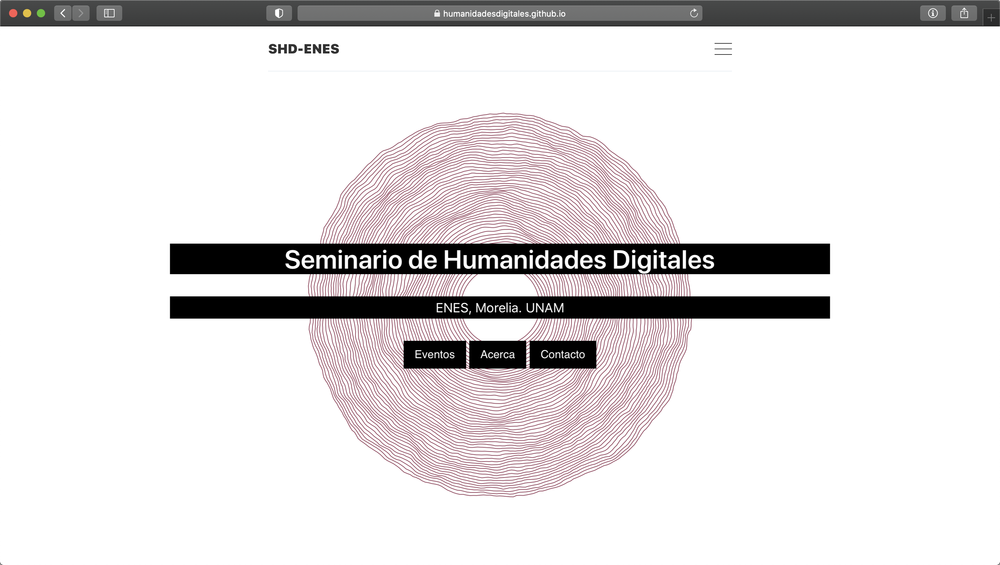
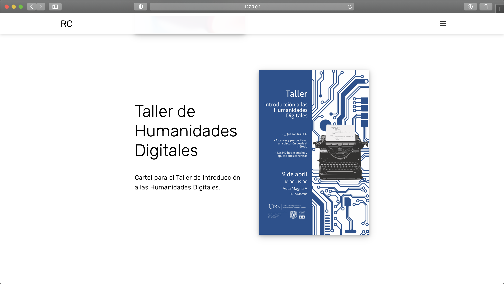

	<section class="info">
		

			

				<h2 class="editable">Web</h2>
			

			

				

					
				

			

		

	</section>

	<section class="info" id="learn-more">
		

			

				<h2 class="editable">Posters</h2>
			

			

				

					
				

			

		

	</section>

 <!-- Load jQuery first -->
 <!-- Load Tilt.js library -->