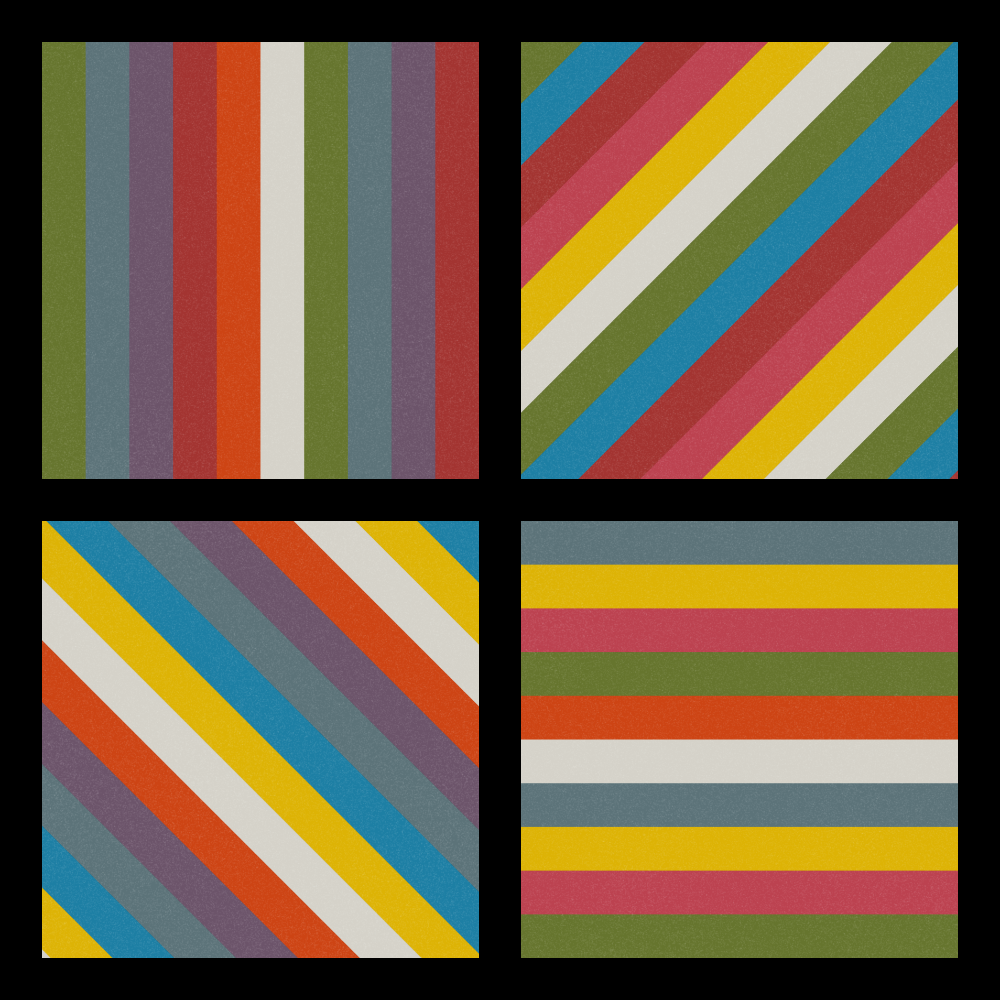

In 1969, Sol LeWitt published "Statements on Conceptual Art", in which he stated that: "Ideas can be works of art" and "It is not necessary for all ideas to become physical".

#### WALL DRAWING #684A

Starting from this concept and with little or no interest in the artist, LeWitt intended for his work to be recreated (or interpreted) multiple times by anyone who had the interest. His work then consisted of a series of instructions that allow his drawings to be constructed by anyone who follows them. In this way we could say that on the one hand LeWitt generalizes the artist and on the other he breaks with tradition and demystifies the work of art as a sacred and tangible object.

>"The idea becomes a machine that makes art" - Sol LeWitt 

#### WALL DRAWING #564

This series of drawings are an algorithmic reintepretation of LeWitt's WALL DRAWINGS and a hommage to his work that laid the foundations of what we call today generative art.

#### WALL DRAWING #118
<iframe id="frame11" src="https://openprocessing.org/sketch/1482269/embed/?plusEmbedHash=ZWVjZWYxN2NlZDRjNGMxMTJmZDI2MWMzZDFiZjMwMjIxYTBlZDBlZTBjYzBjN2U5YmNmZGIwNjhlOTBmYjNhNGMxYjI4NDJlYTVkNDUyYzIwMDYxMTM5MGFkMjk0MWI4M2FiYzVkMmVkZGE5OTU2Y2RhM2Y2OTE4OTJmMjFiYzVUQmNYRzVvdVhIQThlMzAvdUNQM3lwQmlEc0k3WnkyMkJMTTdpV014RFNud2F5ek5iN1phMlM0U0prTCtnL296VkRZWTE1c0hwTXlkR29jL3MwcXJWUT09&plusEmbedFullscreen=true" style="width:100%; height:100vh;"></iframe>

 

# [Curation on OpenProcessing](https://openprocessing.org/curation/73045)