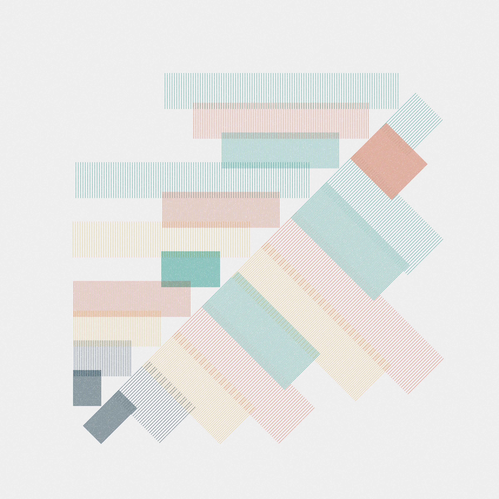
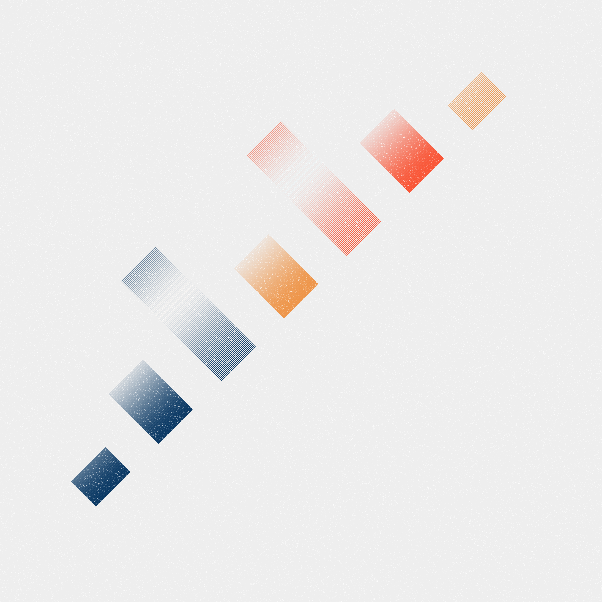
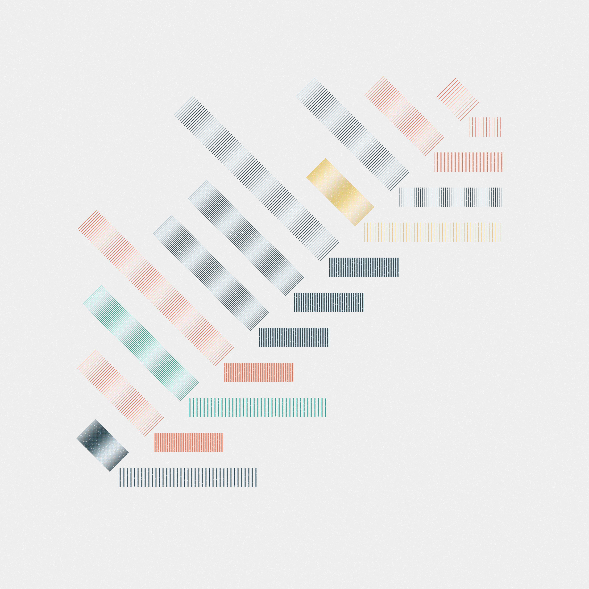
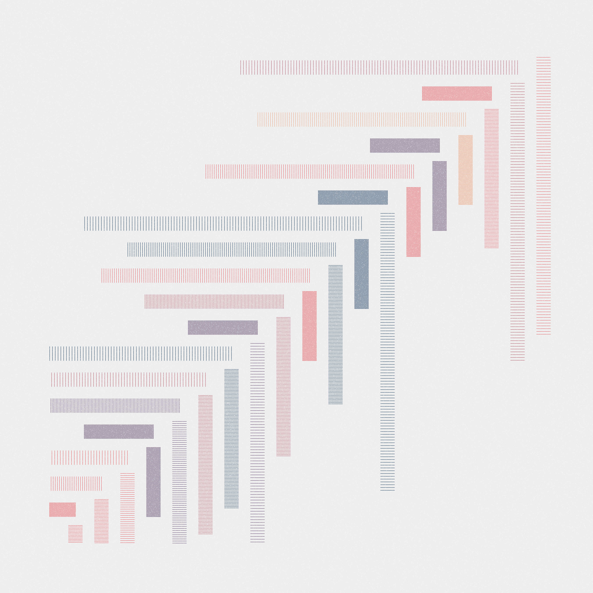
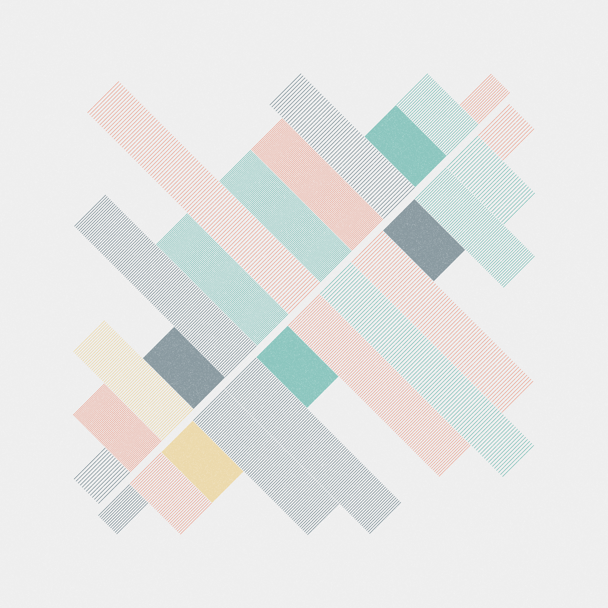
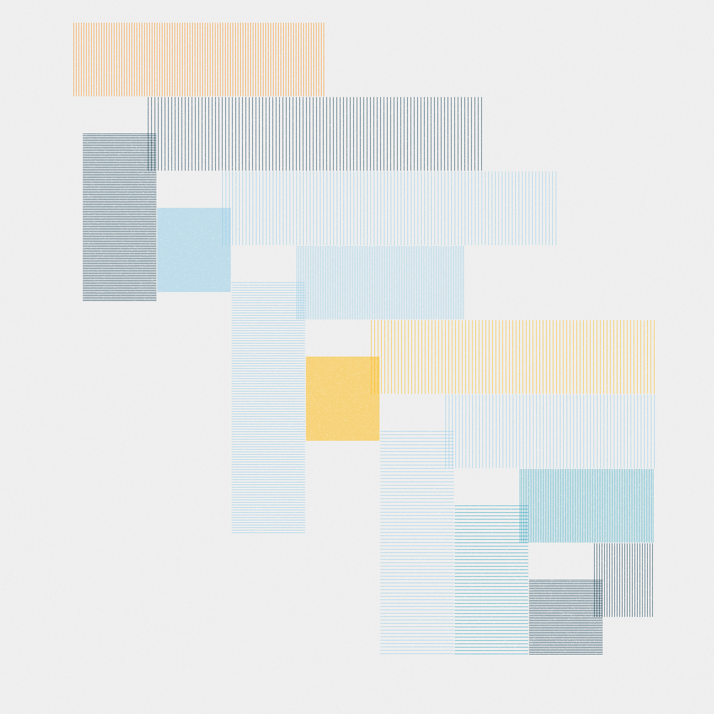
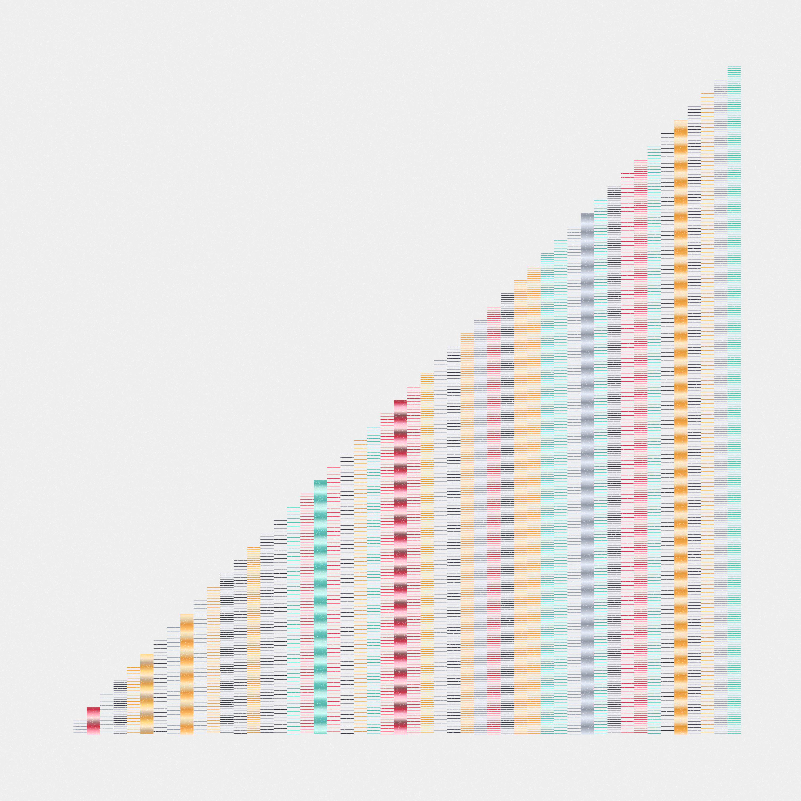

One of the virtues of computational art is that it allows the creation of incredibly precise works, with measurements in which all the strokes coincide perfectly and the margin of error is minimal. However, this medium also allows the creation of random and imperfect works in which there is freedom to make mistakes.

#### Unsquare composition #0

Inspired by Jazz, *Unsquare composition* I experiments with the notion of non-squared rhythmic forms, where freedom and improvisation take as a premise the idea of an imperfection where we can also find harmony. Please do not expect perfect results.

<iframe src="https://embed.music.apple.com/us/album/unsquare-dance/157422527?i=157422726&amp;app=music&amp;itsct=music_box_player&amp;itscg=30200&amp;ls=1&amp;theme=light" height="175px" frameborder="0" sandbox="allow-forms allow-popups allow-same-origin allow-scripts allow-top-navigation-by-user-activation" allow="autoplay *; encrypted-media *; clipboard-write" style="width: 100%; overflow: hidden; border-radius: 10px; background-color: transparent; padding-bottom: 2rem;"></iframe>

#### Color palettes

#### Technique

*Unsquare composition* was made with ❤️ and p5.js

#### Curations and MarketPlace

*Unsquare composition* has been featured in some curations such as:

  * [Code In Technicolor](https://deca.art/spirouzi/technicolor) by @spirouzi 
  * [Grails](https://deca.art/charliesurf/grails) by @charliesurf 

And here're some of my favourite editions:

  
**#121**

  
**#10**

  
**#1**

  
**#60**

  
**#132**

  
**#145**

# [Unsquare composition on FxHash](https://www.fxhash.xyz/generative/11568)

