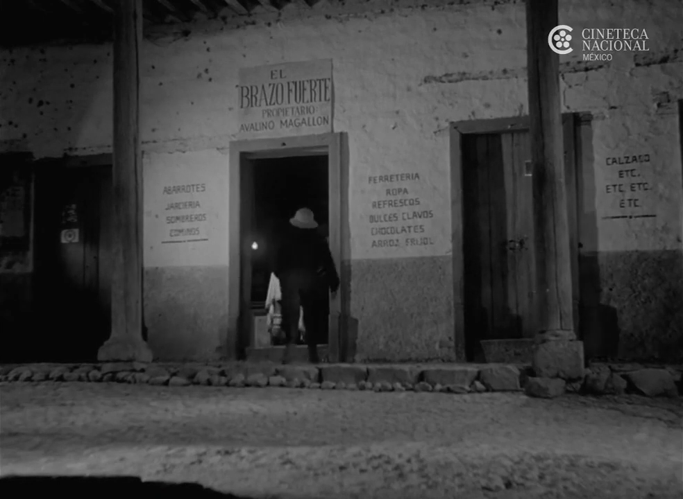
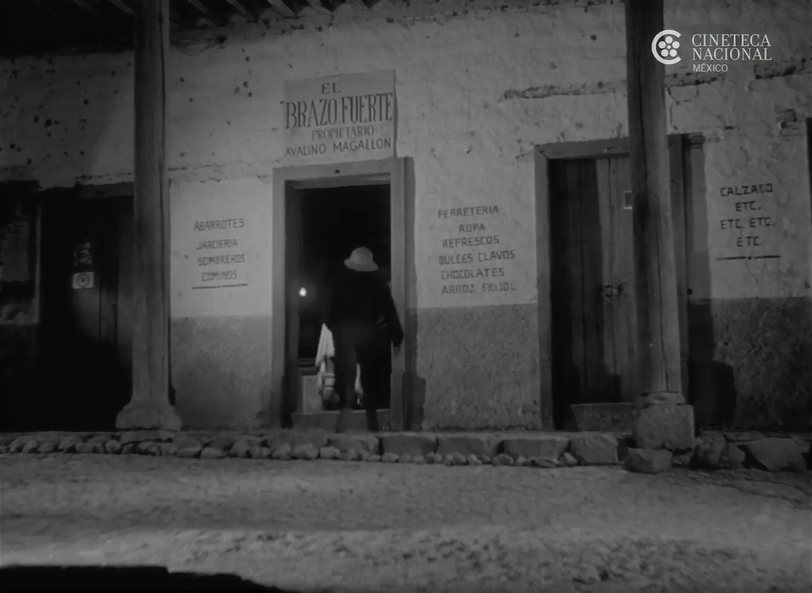
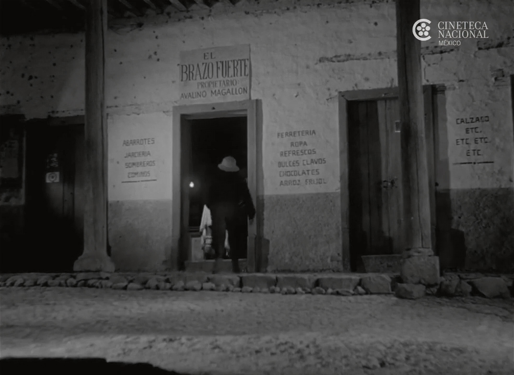
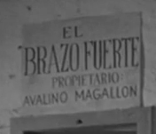

En años recientes se han publicado distintas arquitecturas de redes neuronales que nos posibilitan escalar, interpolar o colorarear *frames* de un video. A continuación se presentan una serie de arquitecturas para los propósitos anteriormente mencionados y los resultados de algunos experimentos realizadas con las mismas.

* Super-scaling Residual Dense Network described in Residual Dense Network for Image Super-Resolution (Zhang et al. 2018)
* Super-scaling Residual in Residual Dense Network described in ESRGAN: Enhanced Super-Resolution Generative Adversarial Networks (Wang et al. 2018)
* DAIN (Depth-Aware video frame INterpolation) para interpolación de *frames*.
* DeOldify para coloreado de *frames*.

## El Brazo Fuerte (1958)

### Original

### RDN GAN + NoiseCancelling

### RRDN GAN

### Original

### RDN GAN + NoiseCancelling

### RRDN GAN

### RDN GAN (NoiseCancelling) + DeOldify

Una semana de procesamiento en la nube con dos NVIDIA Tesla V100.

<iframe width="100%" height="400" src="https://www.youtube-nocookie.com/embed/e7DWYhHvsY8" frameborder="0" allow="accelerometer; autoplay; clipboard-write; encrypted-media; gyroscope; picture-in-picture" allowfullscreen></iframe>
